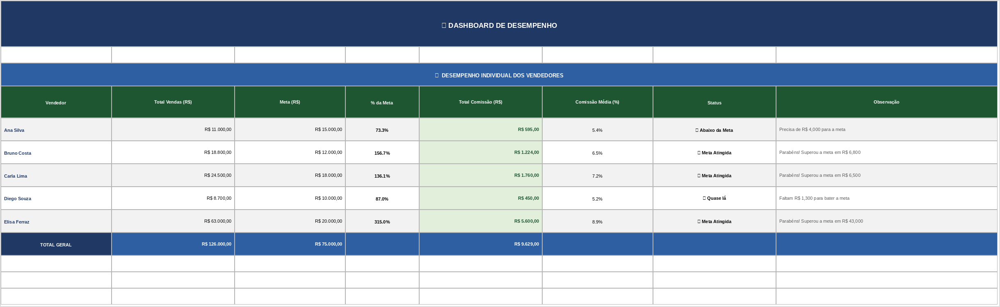
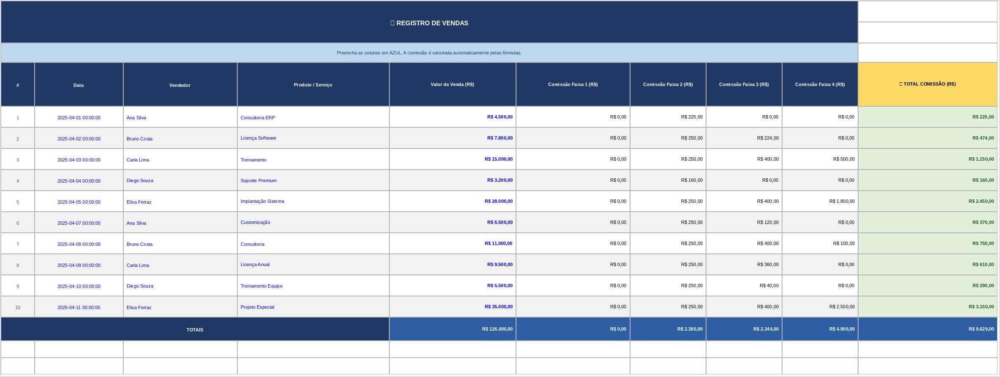
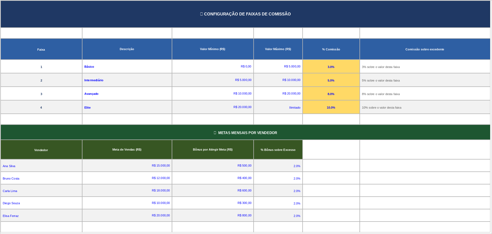

# 💼 Planilha de Comissões Escalonadas — Excel + VBA

> Projeto de portfólio: sistema completo de gestão e cálculo automático de comissões para equipes de vendas.

---

## 📸 Preview

| Dashboard                          | Lançamentos                            | Configuração                             |
| ---------------------------------- | -------------------------------------- | ---------------------------------------- |
|  |  |  |

---

## 📋 Sobre o Projeto

Esta planilha foi desenvolvida para automatizar o cálculo de **comissões escalonadas** de equipes de vendas, eliminando erros manuais e proporcionando visibilidade em tempo real sobre o desempenho de cada vendedor.

O sistema aplica o modelo **progressivo por faixas** — cada parte do valor da venda é comissionada pela alíquota correspondente à sua faixa, similar ao modelo do Imposto de Renda.

---

## ✨ Funcionalidades

- ✅ **Cálculo automático** de comissão ao inserir o valor da venda
- ✅ **4 faixas escalonadas** totalmente configuráveis (sem alterar fórmulas)
- ✅ **Dashboard individual** com total de vendas, comissão e % da meta
- ✅ **Formatação condicional** — destaca quem bateu, está perto ou abaixo da meta
- ✅ **Proteção de células** — fórmulas bloqueadas, apenas entradas liberadas
- ✅ **Guia de uso** dentro da própria planilha
- ✅ **Macros VBA** documentadas e prontas para uso

---

## 💻 Macros VBA Incluídas

| Macro                   | Descrição                                                     |
| ----------------------- | ------------------------------------------------------------- |
| `LimparFormulario`      | Apaga os lançamentos com confirmação do usuário               |
| `CalcularComissaoUnica` | Simulador de comissão via InputBox com resultado detalhado    |
| `ExportarDashboard`     | Salva o dashboard em novo arquivo com a data no nome          |
| `ProtegerPlanilhas`     | Aplica proteção com senha, liberando só as células de entrada |
| `DesprotegerPlanilhas`  | Remove a proteção para edição das fórmulas                    |

---

## 🗂️ Estrutura da Planilha

```
📁 Planilha_Comissoes_Escalonadas.xlsx
│
├── 🏠 Início          → Apresentação e navegação
├── ⚙️ Configuração    → Faixas de comissão e metas (editável)
├── 📊 Lançamentos     → Registro de vendas com cálculo automático
├── 🏆 Dashboard       → Desempenho consolidado por vendedor
└── 💻 Código VBA      → Macros documentadas para importar
```

---

## 📐 Como Funciona o Cálculo Escalonado

Exemplo para uma venda de **R$ 28.000**:

| Faixa | Intervalo             | Taxa | Base de Cálculo | Comissão        |
| ----- | --------------------- | ---- | --------------- | --------------- |
| 1     | R$ 0 – R$ 5.000       | 3%   | R$ 5.000        | R$ 150,00       |
| 2     | R$ 5.001 – R$ 10.000  | 5%   | R$ 5.000        | R$ 250,00       |
| 3     | R$ 10.001 – R$ 20.000 | 8%   | R$ 10.000       | R$ 800,00       |
| 4     | Acima de R$ 20.000    | 10%  | R$ 8.000        | R$ 800,00       |
|       |                       |      | **Total**       | **R$ 2.000,00** |

---

## 🚀 Como Usar

1. Baixe o arquivo `Planilha_Comissoes_Escalonadas.xlsx`
2. Abra no **Microsoft Excel** (recomendado) ou LibreOffice Calc
3. Na aba **⚙️ Configuração**, ajuste as faixas e metas conforme sua empresa
4. Na aba **📊 Lançamentos**, insira as vendas nas colunas em azul
5. Acompanhe os resultados em tempo real no **🏆 Dashboard**

### Para importar o VBA:

```
Alt + F11 → Inserir → Módulo → Cole o código da aba "💻 Código VBA"
```

---

## 🛠️ Tecnologias


- **Microsoft Excel** — fórmulas avançadas (SUMIF, MIN, MAX, IF aninhado)
- **VBA / Macros** — automação, proteção e simulação de comissões
- **Formatação condicional** — feedback visual automático
- **Validação de dados** — prevenção de entradas inválidas

---

## 📁 Estrutura do Repositório

```
📦 excel-comissoes-escalonadas
├── 📄 README.md
├── 📊 Planilha_Comissoes_Escalonadas.xlsx
└── 📁 prints
    ├── dashboard.png
    ├── lancamentos.png
    └── configuracao.png
```

---

## 👤 Autor

Feito por **[Augusto Castilho]**

[](https://www.linkedin.com/in/augusto-castilho87/)
[](https://www.99freelas.com.br/user/castilho87)

---

## 📄 Licença

Este projeto é de uso livre para fins de estudo e portfólio.
